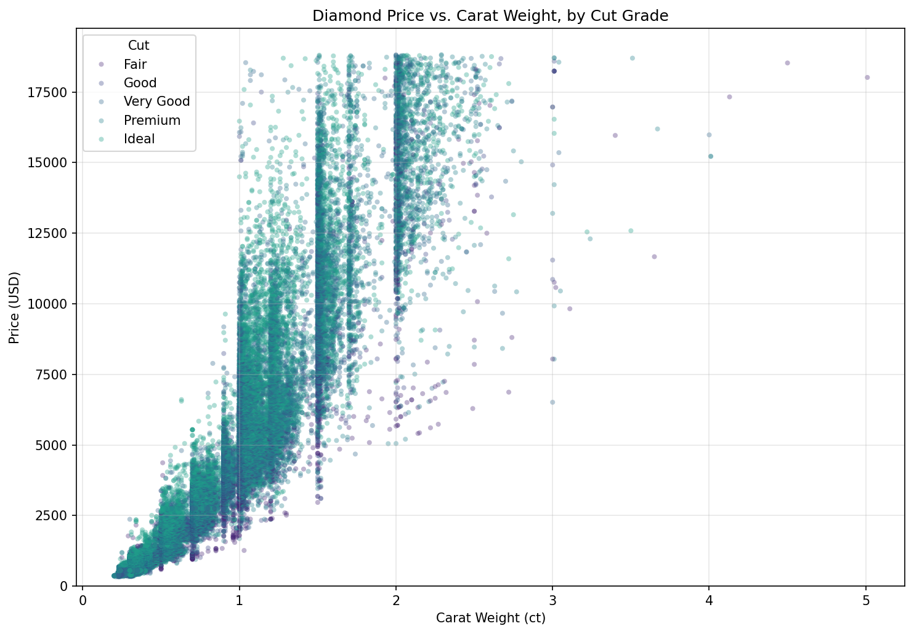
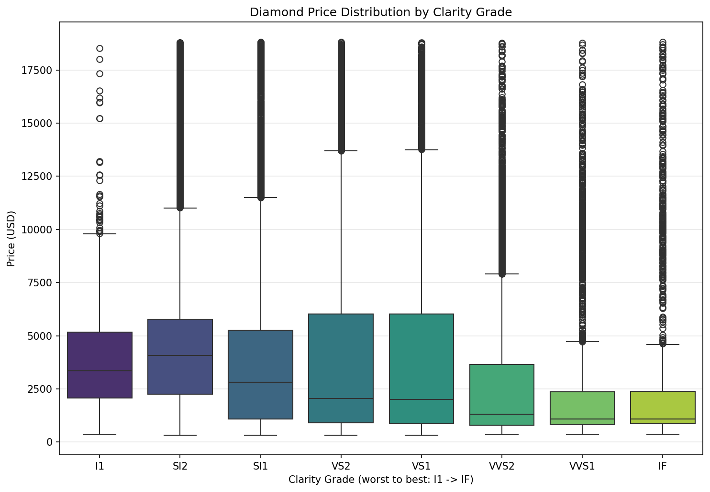
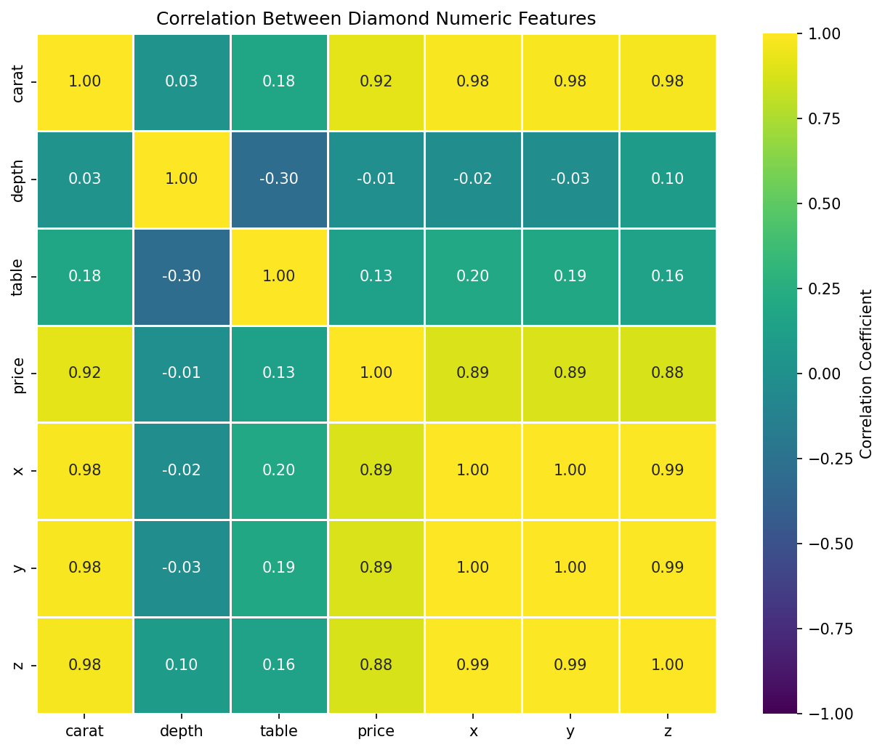

# Module 10 — Can the Price of a Diamond Be Determined Based Upon Its Features?

## Research Question and Dataset

**Research question:** Can the price of a diamond be determined based upon
its features?

**Dataset:** The [Kaggle Diamonds dataset](https://www.kaggle.com/datasets/shivam2503/diamonds)
(`diamonds.csv`, 53,940 rows), one of this assignment's suggested data
sources. It's well matched to the research question: each row is a single
diamond with its price alongside the "4 Cs" (carat weight, cut, color,
clarity) and its physical dimensions (depth, table, x/y/z), giving a rich
set of candidate predictors for price with no separate merging or joining
required.

The dataset is not included in this folder — download `diamonds.csv` from
the link above and place it alongside `visualization.py` / `dashboard.py`,
or pass its path via `--input`.

## Project Goal

Explore how diamond price relates to size (carat) and quality grade (cut,
color, clarity), identify any data-quality issues that could distort that
relationship, and present the findings in a single-page dashboard that
guides a viewer toward a supported conclusion.

## Environment Setup and How to Run

```bash
pip install -r requirements.txt

# Generate all visualizations (PNGs + interactive HTML)
python visualization.py --input diamonds.csv --output-dir .

# Launch the dashboard (serves at http://127.0.0.1:8050)
python dashboard.py --input diamonds.csv
```

Both scripts require Python 3.10+ and expect `diamonds.csv` either in the
current directory or passed via `--input`. `dashboard.py` reads its PNG
images from the `assets/` folder (Dash's standard convention for static
files) — make sure the PNGs generated by `visualization.py` are copied
into `assets/` before running the dashboard (already included in this
submission).

## Exploratory Data Analysis

The raw dataset has no missing values, but 23 rows have physically
impossible diamond dimensions: 20 rows have a length, width, or depth of
exactly 0mm, and 3 rows have a dimension far outside the realistic range
for this dataset (e.g. one row lists a 58.9mm width on an otherwise
normal-sized stone — almost certainly a misplaced decimal in the source
data). These 23 rows were excluded rather than corrected by guessing the
intended value, leaving 53,917 clean rows for analysis.

Carat weight correlates very strongly with price (Pearson r = 0.92) — by
far the single strongest relationship in the data. Raw average price by
quality grade (cut, color, clarity) is confounded by this: because larger
diamonds are more common at lower quality grades in this market, the
**raw** average price is *not* monotonic with quality — for example, Ideal
cut diamonds average $3,457 while Premium cut diamonds average $4,579,
even though Ideal is the better cut. Normalizing price by carat
(price-per-carat) removes this size confound and reveals a real, if
imperfect, quality effect: price-per-carat trends upward with clarity
grade overall, from $2,796/ct at the worst grade (I1) up to $4,259/ct at
the best grade (IF), though the increase isn't perfectly steady — it dips
at a couple of intermediate grades (SI2→SI1 and VVS2→VVS1) rather than
rising in lockstep with grade. Cut and color show a similar pattern: a
general quality-linked shift in price-per-carat, but not a clean,
monotonic step at every single grade.

## Visualizations

### 1. Price vs. Carat Weight, by Cut Grade (Seaborn)



Confirms the dominant carat/price relationship directly: price rises
steeply and non-linearly with carat weight, and the relationship holds
across all five cut grades (shown by color), though better-cut diamonds
(lighter, more teal-green points — Fair, the worst grade, is mapped to
viridis's darkest purple) trend slightly higher at a given carat weight.

### 2. Price Distribution by Clarity Grade (Seaborn)



Shows the raw, unnormalized price distribution across each clarity grade,
ordered from worst (I1) to best (IF). The medians look roughly similar
across grades — this is the size confound described above: without
controlling for carat, clarity's real effect on price-per-carat is masked.

### 3. Correlation Between Numeric Features (Seaborn)



Summarizes how every numeric feature relates to every other. Price
correlates most strongly with carat (0.92) and the physical dimensions
x/y/z (all above 0.85, since larger physical dimensions directly imply
more carat weight), and only weakly with depth and table percentage,
which describe cut proportions rather than size.

### 4. Interactive Explorer: Price vs. Carat, Animated by Cut (Plotly)

Open `price_explorer.html` in a browser, or view it embedded live in the
dashboard. Animating across cut grade (Fair → Ideal) while encoding color
grade (point color) and table percentage (point size) lets a viewer watch
the carat/price relationship directly, and see how it shifts and tightens
as cut quality improves — a view no static chart can provide.

## Dashboard

`dashboard.py` presents the research question as its title, all four
visualizations, and the guiding conclusion described above, on a single
scrollable page. A screenshot of the running dashboard is saved as
`dashboard.png`.

## Conclusion

Yes — diamond price can be substantially explained by its features, but
not by any single feature alone. Carat weight drives the large majority
of price variation, and quality grade (cut, color, clarity) adds a real,
consistent premium on top of that once size is accounted for. Looking at
raw, un-normalized averages by quality grade alone would lead to the wrong
conclusion, since larger stones are unevenly distributed across quality
grades in this dataset. This is an observational, exploratory dataset —
these are strong associations, not a causal model, and no predictive
model was fit here to quantify exactly how much of price each feature
explains.